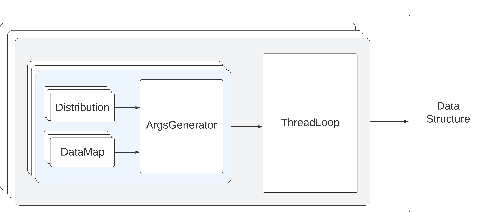

# Benchmark-v700

Benchmark-v700 is an open-source benchmarking framework
for concurrent data structures in [Java](./java) and [C++](./cpp).

##### Note
The `C++` version uses submodules, so it's necessary to clone the repository with them:

```shell
git clone https://github.com/Mr-Ravil/Benchmark-v700.git --recurse-submodules
```


It meets the following requirements:
+ **Modularity:** it should be easy to add new workloads and to reuse existing workloads / code;
+ **Duration:** workloads should be able to run for a fixed number of operations, a fixed time, or infinitely;
+ **Heterogeneity:** the benchmark should be aware of all threads, even internal modification threads;
and should allow different operation mixes among threads;
+ **Realism:** the behavior of the benchmark should mirror real-world workloads, 
and be predictive of the behavior that an application would experience. 
In particular, this must include a robust understanding of skew, as it is an important object of study;
+ **Exploration:** it must be easy to vary parameters of the workload and data structure; and, finally,
+ **Portability:** it should be easy to test the same workloads in different programming languages.

These requirements are described in more detail in the paper: 
[The Next 700 Benchmarking Frameworks for Concurrent Data Structures](https://dl.acm.org/doi/abs/10.1145/3663338.3665827)

## Software Design

[Figure](#bench_uml) shows our flexible benchmark suite through a top-down design.
Each thread (gray box) is assigned its own ThreadLoop.
Each ThreadLoop, in turn, is assigned a set of configurations,
which correspond to the operations it will run (light blue box).
Each operation generates its arguments via a set of PRNGs, distributions over those PRNGs,
and mapping functions for converting the output of a distribution into a key or value.
Note that for simplicity, we depict a tree, but it is possible for a ThreadLoop to share a PRNG, DataMap,
or distribution among its blue boxes, and even for a read-only DataMap to be shared among ThreadLoops.

[//]: # (The workload consists of 4 types of entities:)
To recap, the key entites are:
+ `Distribution` — a distribution of a random variable
+ `DataMap` — converts a distribution's output into a key
+ `ArgsGenerator` — creates operands for an operation
+ `ThreadLoop` — the logic for interacting with a data structure.


<a id="bench_uml"></a>


There are builders each type of entity: 
`ThreadLoopBuilder`, `ArgsGeneratorBuilder`, `DistributionBuilder`, `DataMapBuilder`.

[//]: # ([ThreadLoopBuilder]&#40;microbench/workloads/thread_loops/thread_loop_builder.h&#41;,)
[//]: # ([ArgsGeneratorBuilder]&#40;microbench/workloads/args_generators/args_generator_builder.h&#41;,)
[//]: # ([DistributionBuilder]&#40;microbench/workloads/distributions/distribution_builder.h&#41;,)
[//]: # ([DataMapBuilder]&#40;microbench/workloads/data_maps/data_map_builder.h&#41;.)

[//]: # (There is also a [StopCondition]&#40;microbench/workloads/stop_condition/stop_condition.h&#41;)
There is also a `StopCondition` – a condition in which the load stops working.

[//]: # (It will be described later.)

## Entities

### DataMap

[//]: # (The [DataMap]&#40;microbench/workloads/data_maps/data_map.h&#41; is used by an ArgsGenerator)
The `DataMap` is used by an ArgsGenerator
to translate an index into a key or a value. The `get` function takes an `index` and returns the corresponding key or value.

##### NOTE

[//]: # (The [DataMapBuilder]&#40;./microbench/workloads/data_maps/data_map_builder.h&#41; provides the `getOrBuild` function.)
[//]: # (If it is the first call, the function creates the new DataMap object and returns a pointer to that,)
[//]: # (else it returns the pointer to last created object. Thus, different ArgsGenerators can work with one DataMap.  )
[//]: # (The `getOrBuild` function does not need to be overridden. )

The json representation of DataMapBuilder has an object id.
So converting from json with the same id will return a pointer to the same DataMapBuilder.
Thus, different ArgsGenerators can work with one DataMap.
The id is set automatically.

[//]: # (This function creates the new object if)

### Distribution

[//]: # (The [Distribution]&#40;microbench/workloads/distributions/distribution.h&#41; simulates some random variable.)
The `Distribution` simulates some random variable.

It is important to note that it generates some value from a distribution
that later is translated into an appropriate key or value by an ArgsGenerator.

A Distribution's `next()` method generates a value within some range.  
We also provide a MutableDistribution, which can change the random variable in run-time by modifying the range of keys:
`setRange(int range)` and `next(int range)`, the last one run the `setRange` and `next` functions.

### ArgsGenerator

[//]: # (The [ArgsGenerator]&#40;microbench/workloads/args_generators/args_generator.h&#41; is used to generate keys for operations.  )
The `ArgsGenerator` is used to generate keys for operations.  
In addition to specializing to the types used by a data structure, an ArgsGenerator can be stateful.  
This is important when modeling temporal locality:
a thread-private ArgsGenerator can use a distribution
to occasionally select recently accessed keys without extra synchronization.

##### NOTE
If your implementation of ArgsGenerator does not support some operations,
just use the `setbench_error` function from `errors.h` for the `c++` version, 
and throw the `UnsupportedOperationException` for the `java`.

__Example:__
```c++
// c++
K nextGet() override {
    setbench_error("Unsupported operation -- nextGet")
}
```
```java
// java
@Override
public int nextGet() {
    throw new UnsupportedOperationException();
}
```

### ThreadLoop

[//]: # (The [ThreadLoop]&#40;microbench/workloads/thread_loops/thread_loop.h&#41; decides which operation a thread should execute next.)  
The `ThreadLoop` decides which operation a thread should execute next.
It is initialized for each thread separately and uses the described ArgsGenerators.
Threads are not required to use the same ThreadLoop implementation.
ThreadLoop has only one main method `step`
that explains how to choose an operation and perform it during the running phase.
The method `step` is called in a conditional loop by the `run` method.
A programmer can override `run` when more complicated logic is needed.

Note that ThreadLoop is also a utility class: it calculates different statistics,
for example, the number of successful operations.
This is important for the benchmark in order to compare different data structures and check their correctness.


### StopCondition

[//]: # (The [StopCondition]&#40;microbench/workloads/stop_condition/stop_condition.h&#41; determines the workload operating time.)
The `StopCondition` determines the workload operating time.
The `isStopped` method is called by ThreadLoop before each execution of the `step` method,
and returns `false` if the ThreadLoop should continue and `true` if the ThreadLoop should terminate.  
The countdown begins after calling the `start` function.
In the `c++` version, its completion the `clean` method is called.
The purpose of the `clean` method is to free the resources that the StopCondition may have acquired after it started.  
In contrast to other entities, StopCondition does not have builders, so it is converted to json format on its own.


